# Setup Guide for Migrating a Java Oracle Application to Azure Database for PostgreSQL Sample Application
- [Setup Guide for Migrating a Java Oracle Application to Azure Database for PostgreSQL Sample Application](#setup-guide-for-migrating-a-java-oracle-application-to-azure-database-for-postgresql-sample-application)
  - [Starting Sample Application Architecture](#starting-sample-application-architecture)
  - [Oracle Database ER Diagram](#oracle-database-er-diagram)
  - [Git repo structure](#git-repo-structure)
  - [Installing the Oracle database](#installing-the-oracle-database)
    - [Add the sample blobs](#add-the-sample-blobs)
  - [Installing the Application](#installing-the-application)
    - [Make sure your local Java and Maven environmental variables are set](#make-sure-your-local-java-and-maven-environmental-variables-are-set)
    - [Set your development application runtime environment variables](#set-your-development-application-runtime-environment-variables)
    - [Test the Java API](#test-the-java-api)
  - [Installing and running the Angular application locally](#installing-and-running-the-angular-application-locally)
  - [Summary](#summary)
  - [Migrating to the Cloud](#migrating-to-the-cloud)
    - [Create and configure your Azure resources - Run the ARM template](#create-and-configure-your-azure-resources---run-the-arm-template)
    - [Capture the PostgreSQL configuration](#capture-the-postgresql-configuration)
  - [Set up your migration server and migrate the Oracle database to PostgreSQL](#set-up-your-migration-server-and-migrate-the-oracle-database-to-postgresql)
  - [Finish your Azure resource configuration](#finish-your-azure-resource-configuration)
    - [Update your secrets in Key Vault](#update-your-secrets-in-key-vault)
    - [Update your web application configuration settings with the Azure Key Vault secret values](#update-your-web-application-configuration-settings-with-the-azure-key-vault-secret-values)
  - [Deploy the Java API application to Azure](#deploy-the-java-api-application-to-azure)
  - [Deploy the Angular application to Azure](#deploy-the-angular-application-to-azure)
  - [Summary](#summary-1)
  - [Legal Disclosure](#legal-disclosure)

## Starting Sample Application Architecture
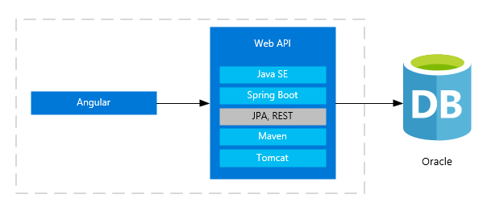

This sample application utilizes the following frameworks and components. The reader is responsible for installing the dependencies.

1. Angular 9 front end
2. Java SE 11 JDK
3. Maven 3.6.3
4. Sprint Boot 2.2.5 RELEASE
5. Embedded Tomcat
6. Oracle 11g Express Edition
7. Azure Database for PostgreSQL 11.
8. npm 6.4.x
9. NodeJS 10.15.x
10. Angular CLI 9.1
11. PowerShell 7.1

## Oracle Database ER Diagram

This diagram provides an overview of the database table structure.

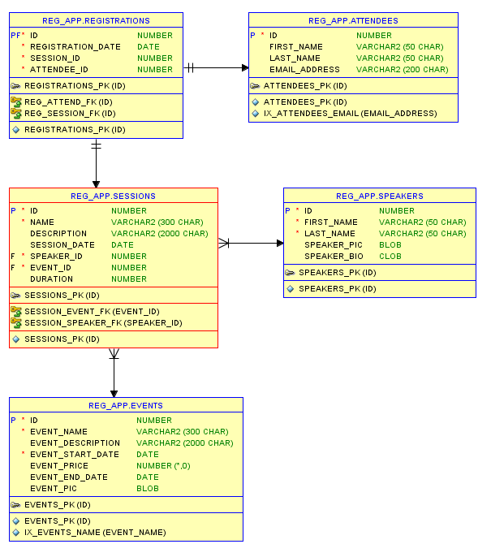

## Git repo structure

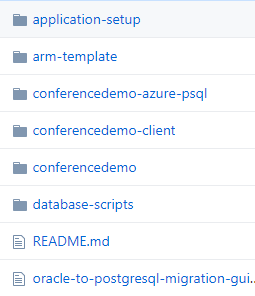
## Installing the Oracle database

In order to run the sample application, you need to have access to some instance of Oracle.  This application has been tested with Oracle 11g XE. The structure is basic enough to work on most versions.  To create your own Oracle instance locally, you can download a copy of Oracle Express Edition.  Also, it is recommended to install the SQLDeveloper client tool as well.  You can use any Oracle compatible client tool of choice.  Once you have access to the database instance, follow these steps.

Create the **REG_APP** user.

>Note: If you are utilizing a server other than a local copy, this account will need elevated permissions to this database in order to properly capture schema and data information for PostgreSQL export.  If you are using a local Oracle XE copy, grant all the rights. It is recommended to use local test instance.

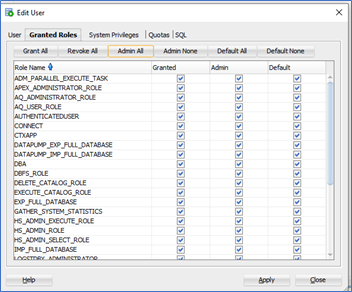

While connected to the REG_APP schema, run the **conferencedemo-oracle.sql** script.  This script will create all of the necessary objects and sample data for your application to run.

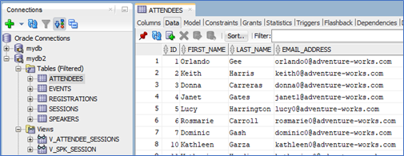

Also, there is a SQL Loader option available as well in the repo as well. It contains the sample blobs as well.

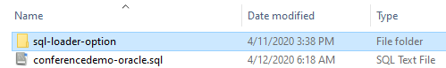

### Add the sample blobs

>Note: You can skip this section if you used the Oracle SQL Loader option.

The basic database schema should be created now with sample data. To update the sample speaker picture blob records, open SQL Developer.  Select the Speaker table and the **Data** tab.  The records should be displayed. The SPEAKER_PIC and SPEAKER_BIO fields will be NULL. Select the pencil icon in the record field.

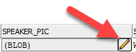

Sample images for the next steps are in the **application-setup** Git folder. Any PNG image can be used.

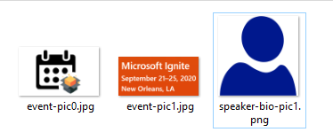

Next, select the **Load** button and upload an image.

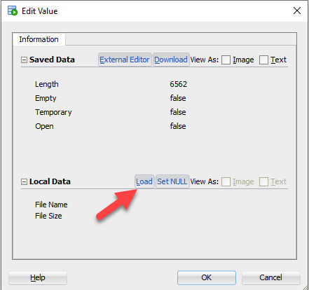

The blob fields will updated with the sample image.  Commit your changes.

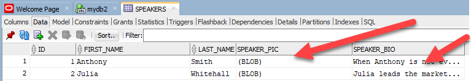

## Installing the Application

### Make sure your local Java and Maven environmental variables are set

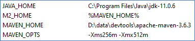

### Set your development application runtime environment variables

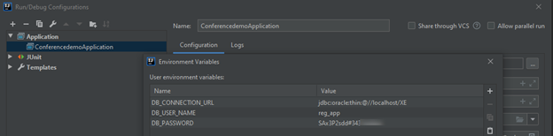

- DB_CONNECTION_URL - Connection to local Oracle database.
- DB_USER_NAME - Oracle database user name.
- DB_PASSWORD - Oracle database password.
- ALLOWED_ORIGINS - e.g. http://localhost:4200  (Default Angular development URL)

>Note:  Your configuration values will be different.  The database user name should be the same.  Use strong passwords.

An alternative, would be to update your application.properties file.  Hardcoding the environment secrets in the application configuration file is not recommended as they will be saved into SCM.  Injecting the secrets at runtime via tokens is a more secure method.

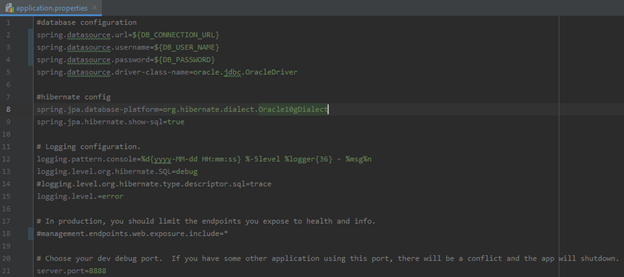

Open your command line or terminal.  Run this Maven command to test your set up and configuration.

``` cmd
    mvn clean package
```

Run your Java API application.

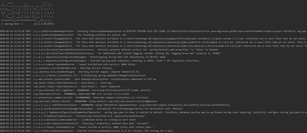

You should see an output similar to this output.

### Test the Java API

In your browser, navigate to:  http://localhost:8888/api/v1/events.

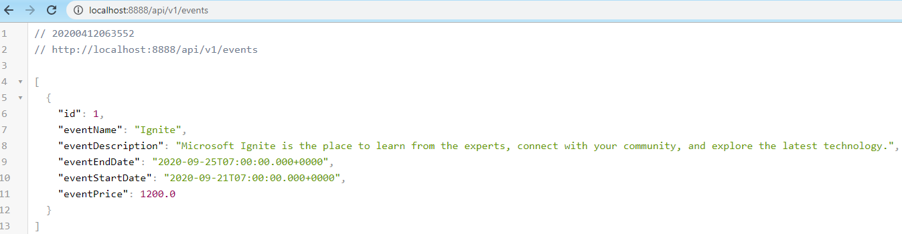

## Installing and running the Angular application locally

This project requires NPM, NodeJS, and the Angular CLI to be installed.

- Install the Angular project dependencies.

``` cmd
  npm install
```

- Build and run the application.

``` cmd
  ng serve -o
```

A web landing page similar to this should be visible:

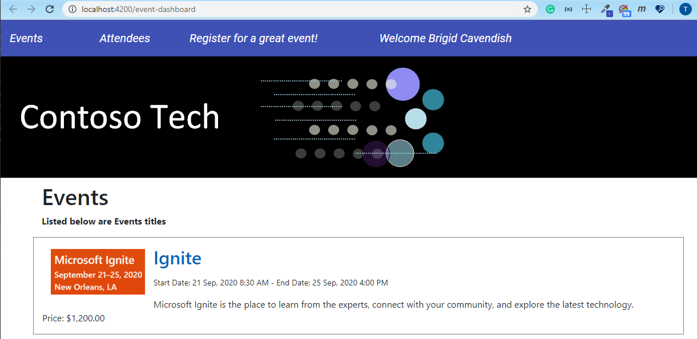

## Summary

At this point, you have simulated the legacy application running on-premises and the migration process can start . The Azure target environment will need to be created. The next section of this document will guide you through these steps.

## Migrating to the Cloud

Once you have tested the sample application locally, you will need to set up the Azure resources.  The **conferencedemo-azure-psql** project contains the Java API project configured to work with the PostgreSQL database.

### Create and configure your Azure resources - Run the ARM template

- Make sure you have Powershell version 5.1 or higher. Run this command in PowerShell to determine your installed version.

  ```ps
  $PSVersionTable.PSVersion
  ```

  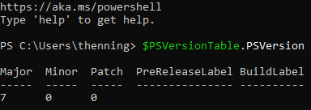

- You must have the Azure module installed. To install the module, run this command.
  
  ```ps
  Install-Module -Name Az -AllowClobber
  ```

- Open the Powershell **deployment.ps1** script in the ISE.

  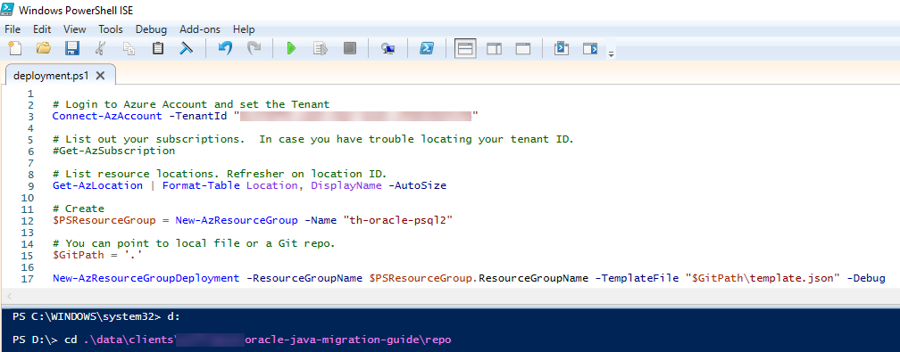

- Change the PS console directory to the ARM template directory.

  ```cmd
  cd .\arm-template
  ```

- Log into your Azure tenant.  If you can't remember your tenant ID, then run:

  ```cmd
  Get-AzSubscription
  ```

  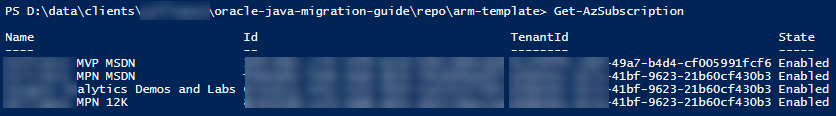

- Capture the resource Location you wish to create the resources. Make sure to  create the resources in a region that supports the services.

  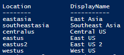

- Enter your resource group name and execute only this command.  e.g. th-oracle-psql2.

  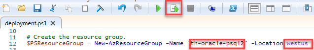

- Create your resources. You should see prompts in the console for your template parameter values. Below is an example of a successful output screen.

  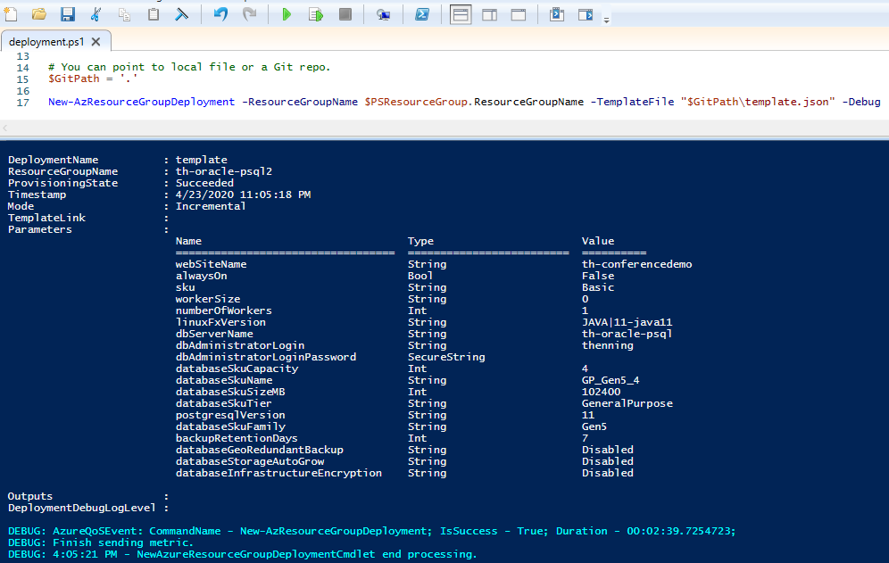

  >Note:  This lab was tested using PostgreSQL 11.  Deploying a different version will bring different challenges.

  Once your base resources are created, create the Azure Key Vault in your resource group.

- Set up the Managed Identity. Set the **Status** to On.

  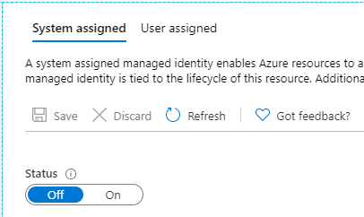

- Select the **Save** button. Select **Yes**.

  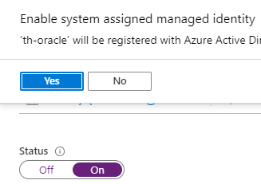

- Add Access Policy.

  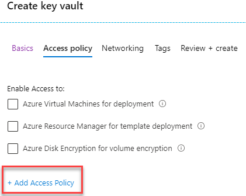

- Select Get and List permissions for the Secrets.
  - Select the service principal you just created.
  
  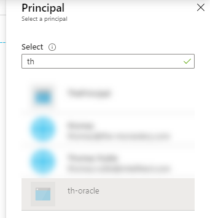

- Select the Add button.

  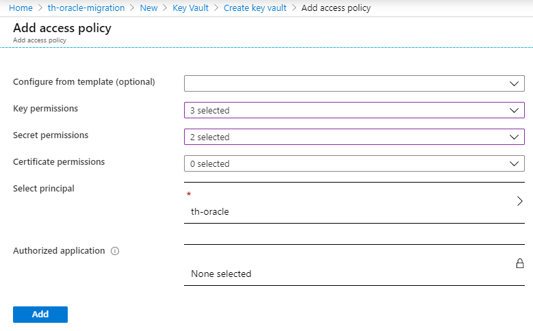 

- Create your secrets. Select Get and List options.  

  - **yourdept-regapp-db-connectionurl** - Connection URL to PostgreSQL database.
  - **yourdept-regapp-db-username** - PostgreSQL database admin user name.
  - **yourdept-regapp-db-password** - PostgreSQL database password.
  
  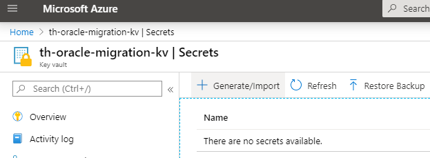

### Capture the PostgreSQL configuration

- Navigate to the PostgreSQL server resource.  Select the **Overview** link.  

  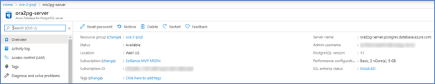

- Set up your Firewall rules.  
  
  If you have a migration server VM that gets shut down at some point, you will have to edit the firewall rules every time you want to connect because you get a new IP address every time you start the VM.  On-premises development environments with test data may be ok with opening the firewall.  It is better to start off as secure as possible.

  0.0.0.0 to 255.255.255.255, **DO NOT USE THIS IP ADDRESS SETTING** if you have ***sensitive protected*** data in this database. It does not matter if it is test data.

  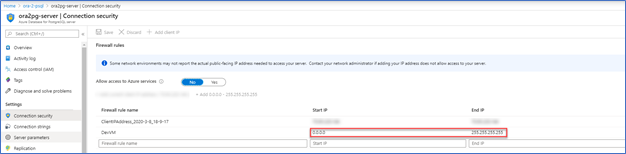

## Set up your migration server and migrate the Oracle database to PostgreSQL

The basic tasks of migration have been listed below.  The task details have been discussed in the *A Guide to Migrating a Java Oracle Application to Azure Database for PostgreSQL* Word document.

- Navigate to your migration server. It can be a VM or your local machine.
- Install the ora2pg utility.
- Make sure the Oracle server or client libraries are installed.
- Install the pgAdmin utility.
- Create a migration user login. Grant access.
- Create the **reg_app** schema in pgAdmin. Grant access to the migration user.
- Create a ora2pg project structure and migrate the database.
  - Configure a conf file to point to the Oracle and PG reg_app schema.
  - Export the Oracle table schema.
  - Run the ora2pg COPY command to migrate the data.
  - Export the rest of the Oracle schema objects and migrate them to the PostgreSQL database.
  - Update the procedure code to call the **reg_app** schema.
  - Update the procedures to work in PostgreSQL PL/pgSQL.

    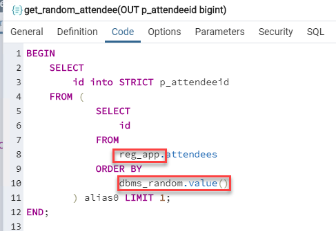
  
The PostgreSQL database should be ready to test using the application.

## Finish your Azure resource configuration

### Update your secrets in Key Vault

- Navigate to the Azure Key Vault.

- Select the Secrets link.
  
  These secrets will be injected into the Java application upon initialization.

  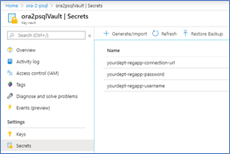

  >Note: To create a new version of the password secret, select the **New Version** button.
    
  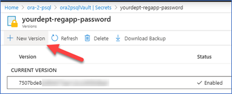

### Update your web application configuration settings with the Azure Key Vault secret values

- Make sure your Java API web application has access to your Key Vault. You will need to set up a policy. Adhere to the policy of least privilege by granting only Get, List, and Decrypt access.

  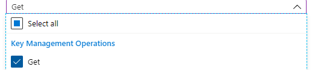

- Capture the Secret Identifier for each of the parameters.
  - Select the parameter.  Select the Current Version.
  - Copy the Secret Identifier URL.

  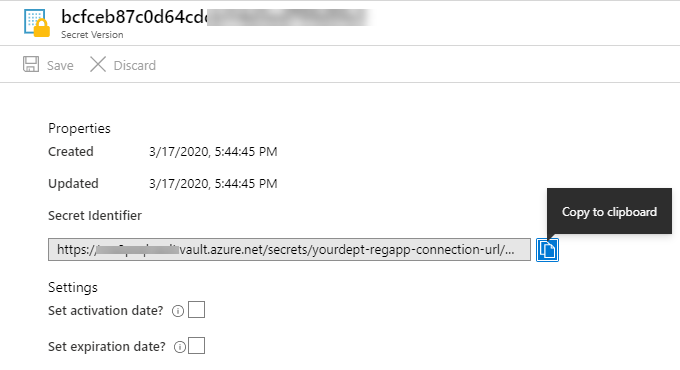

- Wrap the secrets with:
@Microsoft.KeyVault(SecretUri=[Secret Identifier URL]).  See the example below.

  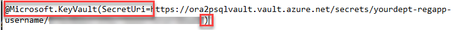

- Update your web configuration for DB_CONNECTION_URL, DB_USER_NAME, and DB_PASSWORD parameters.

  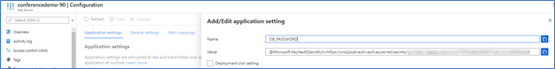

  Your updated Application settings should look similar to this:

  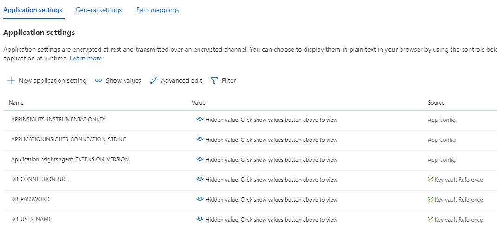

- Next, add your Angular web site URL to the ALLOWED_ORIGINS application setting. This setting will prevent CORS errors. The Angular web site URL can be located in the conferencedemo-client web site overview.

  >Note: Do not include a trailing backslash.

  

## Deploy the Java API application to Azure

Update the **conferencedemo-azure-psql** project to point to your deployed Azure resources.

- Update the pom.xml file in your Maven project.
  - Update the **subscriptionId** with the subscription id you ran the ARM template against.
  - Update the **resourceGroup** with the resource group name.
  - Update the **appName** with the Java API App web site name.
  - Update the **region** with the same region on the Java App API web site is deployed in.
  
  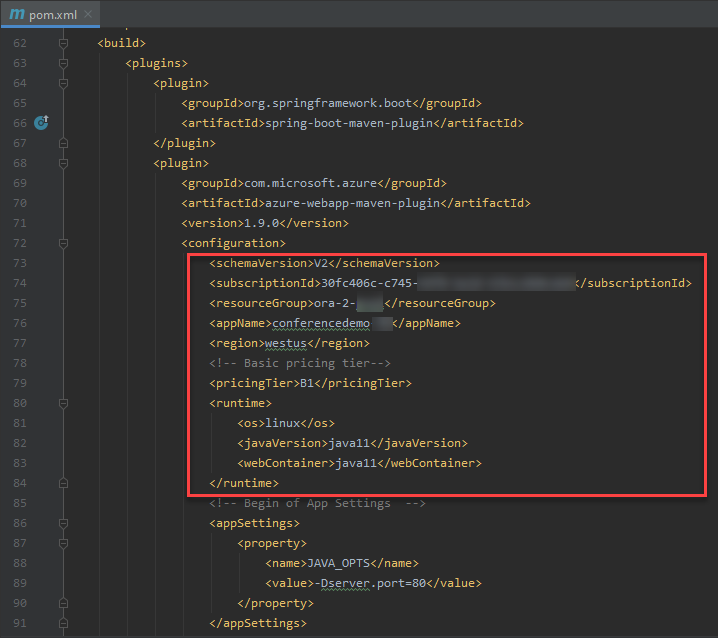

  ```cmd
  rem ## Create the JAR.
  mvn clean package
  ```

  ```cmd
  rem ## Deploy to Azure.
  mvn azure-webapp:deploy
  ```

  Example of a valid deployment messages from the console.

  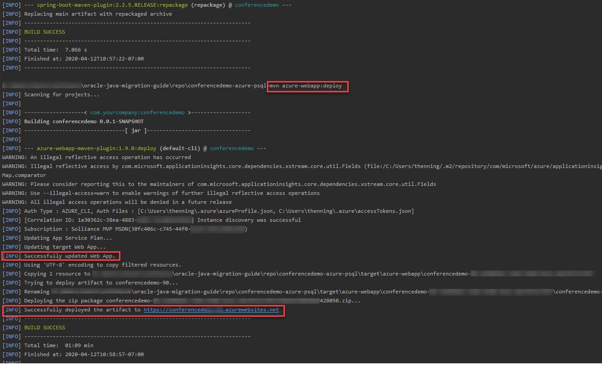

- Test your deployment by calling an endpoint. e.g. http://[your java api url]/api/v1/events.
  
  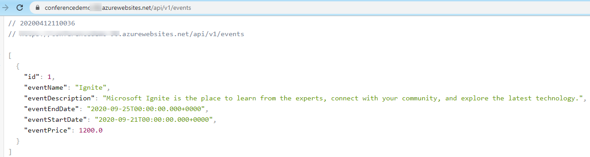

- Check your Azure web site logs

  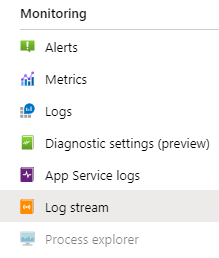

  There should be Hibernate calls logged in the Azure web site logs. Use these entries for debugging purposes.

  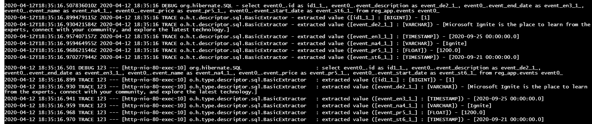

  More advanced logging can be found by selecting the Advanced Tools link.

  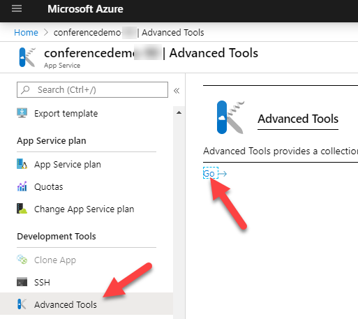

## Deploy the Angular application to Azure

Once your know your Java API URL, it is time to update your Angular application production configuration.

- Navigate to the **environment.prod.ts** file and update the webApiUrl with the API root URL.  Do not include the ending backslash.

  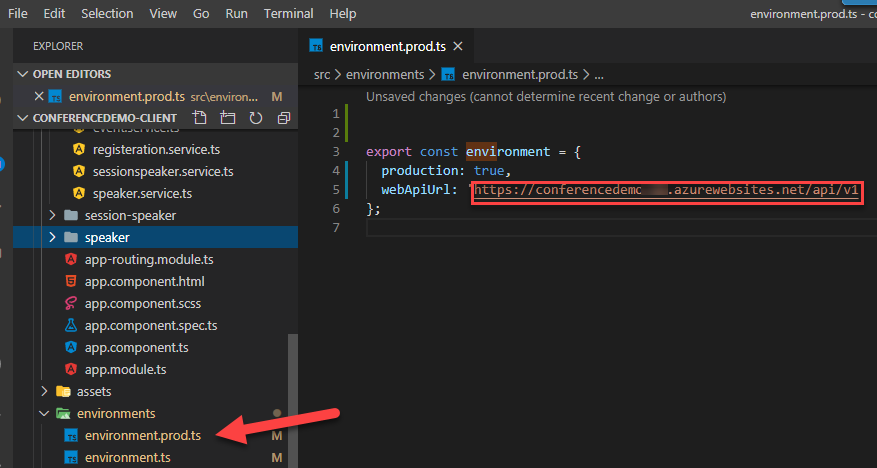

- At the terminal console, build your Angular application using the production settings.

  ```cmd
  ng build --configuration=production
  ```

  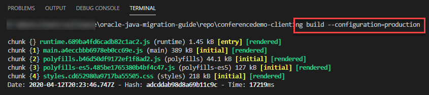

- Navigate to the Azure conferencedemo-client web site. Under **Development Tools**, select **Advanced Tools** in the left panel.
- Open the Debug console using the **CMD**. Drag the Angular dist folder contents from the Windows Explorer into the site root.
  
  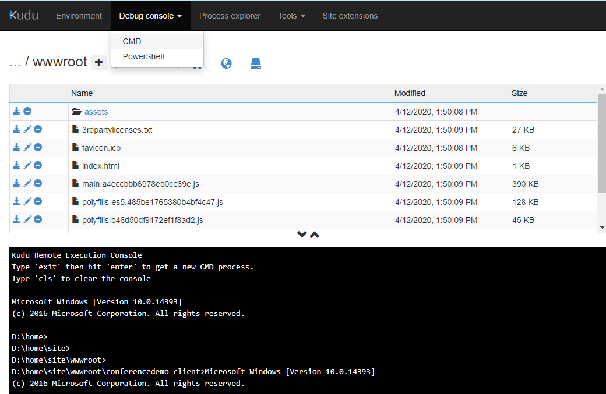

- Test your migrated web site. Navigate to the Angular web site URL.

  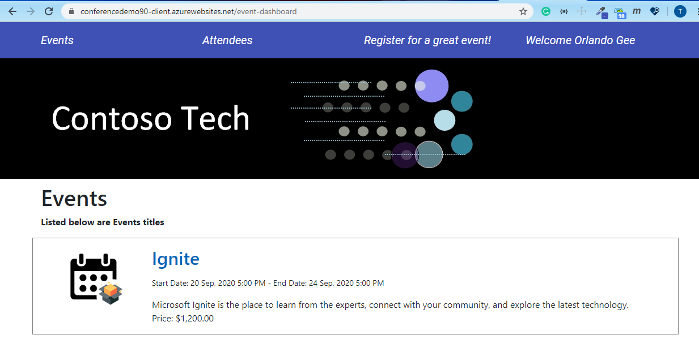

## Summary

At this point, the legacy application environment has been completely migrated to the Azure Cloud Hosted environment.

Delete your resource group when you are done.

## Legal Disclosure

Information in this document, including URL and other Internet Web site references, is subject to change without notice. Unless otherwise noted, the example companies, organizations, products, domain names, e-mail addresses, logos, people, places, and events depicted herein are fictitious, and no association with any real company, organization, product, domain name, e-mail address, logo, person, place or event is intended or should be inferred. Complying with all applicable copyright laws is the responsibility of the user. Without limiting the rights under copyright, no part of this document may be reproduced, stored in or introduced into a retrieval system, or transmitted in any form or by any means (electronic, mechanical, photocopying, recording, or otherwise), or for any purpose, without the express written permission of Microsoft Corporation.

Microsoft may have patents, patent applications, trademarks, copyrights, or other intellectual property rights covering subject matter in this document. Except as expressly provided in any written license agreement from Microsoft, the furnishing of this document does not give you any license to these patents, trademarks, copyrights, or other intellectual property.

The names of manufacturers, products, or URLs are provided for informational purposes only and Microsoft makes no representations and warranties, either expressed, implied, or statutory, regarding these manufacturers or the use of the products with any Microsoft technologies. The inclusion of a manufacturer or product does not imply endorsement of Microsoft of the manufacturer or product. Links may be provided to third party sites. Such sites are not under the control of Microsoft and Microsoft is not responsible for the contents of any linked site or any link contained in a linked site, or any changes or updates to such sites. Microsoft is not responsible for webcasting or any other form of transmission received from any linked site. Microsoft is providing these links to you only as a convenience, adnd the inclusion of any link does not imply endorsement of Microsoft of the site or the products contained therein.

© 2020 Microsoft Corporation. All rights reserved.

Microsoft and the trademarks listed at <https://www.microsoft.com/en-us/legal/intellectualproperty/Trademarks/Usage/General.aspx> are trademarks of the Microsoft group of companies. All other trademarks are property of their respective owners.